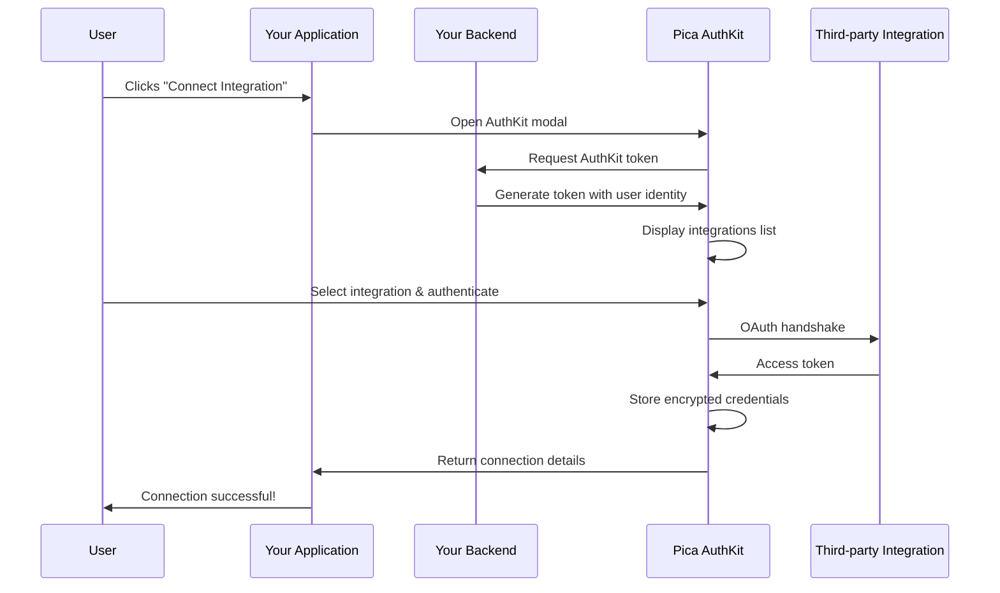

<Frame caption="AuthKit is a pre-built, embeddable authentication UI that makes it easy for your users to securely connect their third-party accounts (Gmail, Slack, Salesforce, QuickBooks, etc.) directly within your application. Think of it as “Plaid for integrations.”">
  
</Frame>

<Note>
At Pica, we dogfood our own products. AuthKit powers the connection experience in Pica's dashboard. [Create a free account](https://app.picaos.com), navigate to the Connected Integrations tab, click "Add Connection", and see AuthKit in action!
</Note>

## Why use AuthKit?

Building authentication flows that handle every possible error state and edge case across multiple integrations is complex and time-consuming. AuthKit solves this by providing:

<CardGroup cols={2}>
  <Card icon="shield-check" title="Secure authentication">
    Handles OAuth flows and API key authentication with automatic token refresh and secure storage
  </Card>
  <Card icon="users" title="Multi-tenant architecture">
    Isolate connections by user, team, organization, or project with built-in identity scoping
  </Card>
  <Card icon="palette" title="Customizable branding">
    White-label the UI to match your brand for enterprise customers
  </Card>
  <Card icon="server" title="Self-hosted OAuth apps">
    Use your own OAuth credentials (Client ID and Secret) for complete control
  </Card>
</CardGroup>

## How it works

AuthKit follows a secure, token-based flow to authenticate your users' third-party accounts:

### The authentication flow explained

<Steps>
  <Step title="User clicks to connect">
    Your user clicks a button in your app to connect an integration (e.g., "Connect Gmail"). This triggers the AuthKit modal to open.
  </Step>
  
  <Step title="AuthKit requests token">
    As the modal opens, AuthKit automatically requests a secure token from your backend. Your backend generates the token with the user's identity (like `userId`, `teamId`, or `organizationId`) which determines who owns the connection.
  </Step>
  
  <Step title="Display integrations">
    AuthKit displays the list of available integrations for the user to browse and select from.
  </Step>
  
  <Step title="User authenticates">
    The user selects an integration and completes the OAuth flow or enters their API key. Pica securely stores the encrypted credentials.
  </Step>
  
  <Step title="Connection created">
    AuthKit returns the connection details to your app, including a `connectionKey` that you'll use to make authenticated API requests.
  </Step>
</Steps>

<Info>
Your backend never sees or stores the user's third-party credentials. Pica handles all authentication securely and returns only the connection metadata to your app.
</Info>

## Key concepts

### Identity and Identity Types

Every connection created through AuthKit is scoped to an **identity**—a unique identifier you provide that represents who owns the connection.

| Identity Type | Example Use Case | Example Identity |
|---------------|------------------|------------------|
| `user` | B2C apps where each user connects their own accounts | `user_123`, email address |
| `team` | Apps where team members share connections | `team_abc`, workspace ID |
| `organization` | Enterprise apps with org-wide integrations | `org_xyz`, company ID |
| `project` | Project-based tools with isolated resources | `project_456`, project UUID |

This identity system enables you to:
- Filter connections by user, team, or organization
- Build multi-tenant applications with proper data isolation
- List and manage connections for specific identities
- Ensure users only access their own integration data

### Connection Keys

When a connection is successfully created, Pica returns a **connection key**—a unique identifier for that specific authenticated connection. You'll use this key when making API requests to access that user's data from the integration.

Example: `test::exa::default::af92aee9cbcd4aae904b9b01d3c75c40|user-123`

## Use cases

<AccordionGroup>
  <Accordion title="B2B or B2C SaaS with customer integrations" icon="briefcase">
    Let your customers connect their Salesforce, HubSpot, or QuickBooks accounts to sync data with your platform. Each customer's connections are isolated by their organization ID.
  </Accordion>
  
  <Accordion title="Productivity apps with personal accounts" icon="user-check">
    Enable users to connect their personal Gmail, Google Calendar, or Slack accounts to automate workflows. Each user owns their own connections.
  </Accordion>
  
  <Accordion title="Team collaboration tools" icon="users">
    Allow teams to share integration connections across all team members. Set the identity to a team ID so everyone on the team can access the same connected accounts.
  </Accordion>
  
  <Accordion title="White-label platforms" icon="palette">
    Build a platform where your customers can offer integrations to their end users.
  </Accordion>
</AccordionGroup>

## What's next?

<CardGroup cols={2}>
  <Card
    title="Set up AuthKit"
    icon="code"
    href="/authkit/setup"
  >
    Follow the technical guide to integrate AuthKit into your application
  </Card>
  <Card
    title="Manage AuthKit"
    icon="gear"
    href="/authkit/management"
  >
    Learn how to configure integrations, work with user connections and make authenticated requests
  </Card>
  <Card
    title="View demo app"
    icon="github"
    href="https://github.com/picahq/authkit-demo"
  >
    See a complete Next.js implementation of AuthKit
  </Card>
  <Card
    title="Browse integrations"
    icon="plug"
    href="https://app.picaos.com/authkit"
  >
    Explore all integrations available through AuthKit
  </Card>
</CardGroup>

