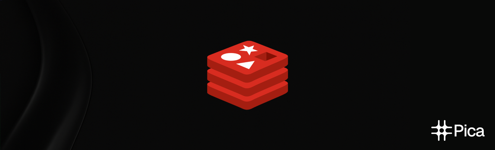

<Update label="January 12, 2026" description="2.12.0">
  ## Passthrough API Examples

  <Frame>
    
  </Frame>

  ### What's new?
  - **[Passthrough API Examples](https://app.picaos.com/tools)**: You can now copy sample curl commands for any action in the catalog and view the schema fields needed.

  - **Bug Fix: Billing** fixed an issue that caused problems for some new users not having a proper billing profile setup by default.

  - **[New Custom Actions](https://app.picaos.com/tools)**: We've added new custom actions for:
    

      

        <a href="https://app.picaos.com/tools/vercel" style={{ display: 'flex', alignItems: 'center', gap: '0.5rem', textDecoration: 'none', borderRadius: '8px', height: '30px' }}>
          
          Vercel <Icon icon="arrow-up-right-from-square" size={12} />
        </a>
      

    

  ### New Integrations Added 🚀
  <CardGroup cols={3}>
    <Card title="Fathom" icon="https://assets.picaos.com/connectors/fathom.svg" href="https://fathom.ai">Fathom</Card>
    <Card title="HighLevel" icon="https://assets.picaos.com/connectors/gohighlevel.svg" href="https://gohighlevel.com">HighLevel</Card>
  </CardGroup>
</Update>

<Update label="December 23, 2025" description="2.11.0">
  ## Introducing Light Mode

  <Frame>
    
  </Frame>

  ### What's new?
  - **[Light Mode](https://app.picaos.com)**: The entire Pica platform now supports light mode across all pages and components for a brighter, more accessible experience.

  - **[Enterprise OAuth Support](https://app.picaos.com/authkit)**: Enterprise users can now use Pica's OAuth app in AuthKit, simplifying authentication setup for larger organizations.

  - **[Connection Notifications](https://app.picaos.com/notifications)**: Notifications are now visible for errors and updates with connections, keeping you informed about the status of your integrations.

  - **[AuthKit UI Improvements](https://app.picaos.com/authkit)**: Improved typography and feedback screens UI in AuthKit for a cleaner, more polished experience.

  - **Bug Fix: Actions Pagination** fixed an issue where actions could return inconsistent data when paginating through results.

  - **Bug Fix: Platform API Colors** fixed the graph colors for calls per platform to display distinct colours correctly.

  - **Bug Fix: Passthrough API** fixed an issue with the passthrough API for actions with no path after the base URL that were not working as expected.

  ### New Integrations Added 🚀
  <CardGroup cols={3}>
    <Card title="Postmark" icon="https://assets.picaos.com/connectors/postmark.svg" href="https://postmarkapp.com">Email</Card>
    <Card title="Parsera" icon="https://assets.picaos.com/connectors/parsera.svg" href="https://parsera.org">Scraping</Card>
    <Card title="Scrape.do" icon="https://assets.picaos.com/connectors/scrape-do.svg" href="https://scrape.do">Scraping</Card>
    <Card title="DataForSEO" icon="https://assets.picaos.com/connectors/data-for-seo.svg" href="https://dataforseo.com">SEO</Card>
    <Card title="Browse AI" icon="https://assets.picaos.com/connectors/browse-ai.svg" href="https://browse.ai">Scraping</Card>
    <Card title="Brevo" icon="https://assets.picaos.com/connectors/brevo.svg" href="https://www.brevo.com">Marketing</Card>
    <Card title="OnePageCRM" icon="https://assets.picaos.com/connectors/one-page-crm.svg" href="https://onepagecrm.com">CRM</Card>
    <Card title="Waterfall" icon="https://assets.picaos.com/connectors/waterfall.svg" href="https://waterfall.io">Enrichment</Card>
    <Card title="Shortcut" icon="https://assets.picaos.com/connectors/shortcut.svg" href="https://shortcut.com">Project Management</Card>
    <Card title="Sage Sales Management" icon="https://assets.picaos.com/connectors/sage-sales-management.svg" href="https://www.forcemanager.com">CRM</Card>
    <Card title="Paystack" icon="https://assets.picaos.com/connectors/paystack.svg" href="https://paystack.com">Payments</Card>
  </CardGroup>
</Update>

<Update label="November 21, 2025" description="2.10.0">
  ## Migrating Next UI to Shadcn

  <Frame>
    
  </Frame>

  ### What's new?
  - **[Dashboard UI](https://app.picaos.com)**: The dashboard interface has been migrated from Next UI to Shadcn for a more modern look, better accessibility, and improved performance.

  - **[Action Filtering](https://app.picaos.com/tools)**: We've added a new action filtering feature to the tools page, allowing you to filter actions by tags.

  - **[SEO Optimizations](https://app.picaos.com)**: We've optimized the platform for search engines, improving the discoverability of all pages.

  - **[New Custom Actions](https://app.picaos.com/tools)**: We've added new custom actions for:
    

      

        <a href="https://app.picaos.com/tools/jira" style={{ display: 'flex', alignItems: 'center', gap: '0.5rem', textDecoration: 'none', borderRadius: '8px', height: '30px' }}>
          
          Jira <Icon icon="arrow-up-right-from-square" size={12} />
        </a>
        <a href="https://app.picaos.com/tools/notion" style={{ display: 'flex', alignItems: 'center', gap: '0.5rem', textDecoration: 'none', borderRadius: '8px', height: '30px' }}>
          
          Notion <Icon icon="arrow-up-right-from-square" size={12} />
        </a>
      

    

  ### New Integrations Added 🚀
  <CardGroup cols={3}>
    <Card title="ClickHouse" icon="https://assets.picaos.com/connectors/click-house.svg" href="https://clickhouse.com">Database</Card>
    <Card title="Q2" icon="https://assets.picaos.com/connectors/q2.svg" href="https://q2.com">Finance</Card>
    <Card title="Hoop" icon="https://assets.picaos.com/connectors/hoop.svg" href="https://hoop.dev">Security</Card>
    <Card title="AgentMail" icon="https://assets.picaos.com/connectors/agent-mail.svg" href="https://agentmail.to">Email</Card>
    <Card title="Placekey" icon="https://assets.picaos.com/connectors/placekey.svg" href="https://placekey.io">Mapping</Card>
    <Card title="Coda" icon="https://assets.picaos.com/connectors/coda.svg" href="https://coda.io">Productivity</Card>
    <Card title="Parsehub" icon="https://assets.picaos.com/connectors/parsehub.svg" href="https://parsehub.com">Scraping</Card>
    <Card title="Benchmark Email" icon="https://assets.picaos.com/connectors/benchmark-email.svg" href="https://benchmarkemail.com">Marketing</Card>
    <Card title="Currents News" icon="https://assets.picaos.com/connectors/currents-news.svg" href="https://currentsapi.services">News</Card>
  </CardGroup>
</Update>

<Update label="November 13, 2025" description="2.9.0">
  ## Major Modernization to the AuthKit UI

  <Frame>
    
  </Frame>

  ### What's new?
  - **[AuthKit UI](https://app.picaos.com/authkit)**: The AuthKit interface has been migrated from Chakra UI to Shadcn for a more modern look, better accessibility, and improved performance.

 - **[BuildKit Chat Enhancements](https://buildkit.picaos.com)**: BuildKit chat now has a smoother and more intuitive workflow for generating integration code.

  - **[Bolt.new Integration Tutorials](https://picaos.com/bolt/use-cases)**: [Bolt](https://bolt.new) and Pica have partnered to bring new integration tutorials for bringing integrations into your AI applications.

  - **Optimized Dashboard Layout**: The app layout is now optimized for sizing consistency across all pages.
 
  - **[New Custom Actions](https://app.picaos.com/tools)**: We've added new custom actions for:
    

      

        <a href="https://app.picaos.com/tools/netlify" style={{ display: 'flex', alignItems: 'center', gap: '0.5rem', textDecoration: 'none', borderRadius: '8px', height: '30px' }}>
          
          Netlify <Icon icon="arrow-up-right-from-square" size={12} />
        </a>
      

    

  ### New Integrations Added 🚀
  <CardGroup cols={3}>
    <Card title="Gorgias" icon="https://assets.picaos.com/connectors/gorgias.svg" href="https://gorgias.com">Customer Support</Card>
    <Card title="Dovetail" icon="https://assets.picaos.com/connectors/dovetail.svg" href="https://dovetail.com">Customer Support</Card>
    <Card title="Fireberry" icon="https://assets.picaos.com/connectors/fireberry.svg" href="https://fireberry.com">CRM</Card>
    <Card title="CATS" icon="https://assets.picaos.com/connectors/cats.svg" href="https://catsone.com">ATS</Card>
    <Card title="Kommo" icon="https://assets.picaos.com/connectors/kommo.svg" href="https://kommo.com">CRM</Card>
    <Card title="Go Dial" icon="https://assets.picaos.com/connectors/go-dial.svg" href="https://godial.cc">CRM</Card>
    <Card title="Salesmate" icon="https://assets.picaos.com/connectors/salesmate.svg" href="https://salesmate.io">CRM</Card>
    <Card title="JobNimbus" icon="https://assets.picaos.com/connectors/job-nimbus.svg" href="https://jobnimbus.com">CRM</Card>
    <Card title="Capsule" icon="https://assets.picaos.com/connectors/capsule.svg" href="https://capsulecrm.com">CRM</Card>
  </CardGroup>
</Update>

<Update label="October 31, 2025" description="2.8.0">
  ## Enterprise Organizations and Projects

  <Frame caption="Collaborate at scale — with structure, control, and flexibility">
    <iframe
      className="w-full aspect-video rounded-xl"
      src="https://www.youtube.com/embed/hJ1cwV-L49c"
      title="Introducing Organizations and Projects"
      frameBorder="0"
      allow="accelerometer; autoplay; clipboard-write; encrypted-media; gyroscope; picture-in-picture"
      allowFullScreen
    ></iframe>
  </Frame>

  ### What's new?
  - **[Organizations and Projects](/get-started/organization-and-projects)**: We're excited to launch Organizations and Projects for enterprise users! Now, teams can collaborate at scale — with structure, control, and flexibility. Here's what's new:
    - 🏢 **Organizations**: Create and manage dedicated orgs for your company
    - 📁 **Projects**: Organize integrations, workflows, and environments by project
    - 👥 **Roles & Permissions**: Invite members as Admins, Managers, or Members with clear access control
    
    Perfect for larger teams, multi-tenant setups, or anyone managing multiple environments under one account. Read the [docs](/get-started/organization-and-projects) for detailed setup, best practices, and permission reference.

  - **Redesigned Dashboard Layout**: Redesigned the dashboard layout including the header and sidebar to better organize pages and improve navigation across the platform.
    <Frame style={{ marginTop: '.5rem' }}>
      
    </Frame>

  - **[New Custom Actions](https://app.picaos.com/tools)**: We've added new custom actions for multiple integrations:
    

      

        <a href="https://app.picaos.com/tools/stripe" style={{ display: 'flex', alignItems: 'center', gap: '0.5rem', textDecoration: 'none', borderRadius: '8px', height: '30px' }}>
          
          Stripe <Icon icon="arrow-up-right-from-square" size={12} />
        </a>
        <a href="https://app.picaos.com/tools/vercel" style={{ display: 'flex', alignItems: 'center', gap: '0.5rem', textDecoration: 'none', borderRadius: '8px', height: '30px' }}>
          
          Vercel <Icon icon="arrow-up-right-from-square" size={12} />
        </a>
        <a href="https://app.picaos.com/tools/calendly" style={{ display: 'flex', alignItems: 'center', gap: '0.5rem', textDecoration: 'none', borderRadius: '8px', height: '30px' }}>
          
          Calendly <Icon icon="arrow-up-right-from-square" size={12} />
        </a>
        <a href="https://app.picaos.com/tools/shippo" style={{ display: 'flex', alignItems: 'center', gap: '0.5rem', textDecoration: 'none', borderRadius: '8px', height: '30px' }}>
          
          Shippo <Icon icon="arrow-up-right-from-square" size={12} />
        </a>
      

      

        <a href="https://app.picaos.com/tools/apollo" style={{ display: 'flex', alignItems: 'center', gap: '0.5rem', textDecoration: 'none', borderRadius: '8px', height: '30px' }}>
          
          Apollo <Icon icon="arrow-up-right-from-square" size={12} />
        </a>
        <a href="https://app.picaos.com/tools/google-drive" style={{ display: 'flex', alignItems: 'center', gap: '0.5rem', textDecoration: 'none', borderRadius: '8px', height: '30px' }}>
          
          Google Drive <Icon icon="arrow-up-right-from-square" size={12} />
        </a>
        <a href="https://app.picaos.com/tools/trello" style={{ display: 'flex', alignItems: 'center', gap: '0.5rem', textDecoration: 'none', borderRadius: '8px', height: '30px' }}>
          
          Trello <Icon icon="arrow-up-right-from-square" size={12} />
        </a>
      

      

        <a href="https://app.picaos.com/tools/cal-com" style={{ display: 'flex', alignItems: 'center', gap: '0.5rem', textDecoration: 'none', borderRadius: '8px', height: '30px' }}>
          
          Cal.com <Icon icon="arrow-up-right-from-square" size={12} />
        </a>
        <a href="https://app.picaos.com/tools/active-campaign" style={{ display: 'flex', alignItems: 'center', gap: '0.5rem', textDecoration: 'none', borderRadius: '8px', height: '30px' }}>
          
          ActiveCampaign <Icon icon="arrow-up-right-from-square" size={12} />
        </a>
        ...and more!
      

    

  ### New Integrations Added 🚀
  <CardGroup cols={3}>
    <Card title="Riveter" icon="https://assets.picaos.com/connectors/riveter.svg" href="https://riveterhq.com">Scraping</Card>
    <Card title="Nyne.ai" icon="https://assets.picaos.com/connectors/nyne-ai.svg" href="https://nyne.ai">AI</Card>
  </CardGroup>
</Update>

<Update label="October 17, 2025" description="2.7.0">
  ## Enhanced Security & Performance Improvements

  <Frame>
    
  </Frame>

  ### What's new?
  - **[One-Time Copyable API Keys](https://app.picaos.com/settings/api-keys)**: Enhanced security for Pica API Keys with one-time copy functionality. After creation, API keys are displayed only once.
  - **[Pica MCP Server 2.0.0](https://github.com/picahq/mcp)**: Major version upgrade featuring vector search for actions, drastically optimized context usage for faster and more efficient performance, and a new [hosted remote MCP server](https://mcp.picaos.com) option.
    
  - **[Custom Actions Performance](https://app.picaos.com/tools)**: Upgraded infrastructure for custom actions, delivering significantly faster performance especially for larger data requests and complex operations.
  - **[Chat Playground Improvements](https://app.picaos.com/connections)**: Enhanced the playground with bug fixes, improved streaming capabilities, and more responsive interactions for a smoother user experience.

</Update>

<Update label="September 25, 2025" description="2.6.0">
  ## ToolKit for the Vercel AI SDK

  <Frame>
    
  </Frame>

  ### What's new?
  - **[ToolKit for the Vercel AI SDK](https://npmjs.com/package/@picahq/toolkit)**: OneTool is now ToolKit—fully rebuilt for Vercel AI SDK 5, with drastically reduced context usage, smarter action lookup, cleaner system prompts, and the latest standards and dependencies.
  - **[New Custom Actions](https://app.picaos.com/tools)**: We've added new custom actions for multiple integrations:
    

      

        <a href="https://app.picaos.com/tools/asana" style={{ display: 'flex', alignItems: 'center', gap: '0.5rem', textDecoration: 'none', borderRadius: '8px', height: '30px' }}>
          
          Asana <Icon icon="arrow-up-right-from-square" size={12} />
        </a>
        <a href="https://app.picaos.com/tools/jira" style={{ display: 'flex', alignItems: 'center', gap: '0.5rem', textDecoration: 'none', borderRadius: '8px', height: '30px' }}>
          
          Jira <Icon icon="arrow-up-right-from-square" size={12} />
        </a>
        <a href="https://app.picaos.com/tools/zendesk" style={{ display: 'flex', alignItems: 'center', gap: '0.5rem', textDecoration: 'none', borderRadius: '8px', height: '30px' }}>
          
          Zendesk <Icon icon="arrow-up-right-from-square" size={12} />
        </a>
        ...and more!
      

    

  - **[Edit Scopes Modal Improvements](https://app.picaos.com/authkit)**: The edit scopes modal in the AuthKit page now includes convenient "Select All" and "Deselect All" options, making it easier to manage permissions for your integrations.
  - **[Search Actions Endpoint](https://app.picaos.com/tools)**: Added a new endpoint for vector search across platform actions.
  - **[Chat Playground](https://app.picaos.com/connections)**: The chat playground in the app dashboard now features a complete redesign using ToolKit and the new [AI Elements UI](https://ai-sdk.dev/elements/overview) for a more interactive and intuitive experience.
  - **[Latest Rust Version](https://blog.rust-lang.org/2025/09/18/Rust-1.90.0/)**: We've upgraded to Rust 1.90 to improve performance and security.

  ### New Integrations Added 🚀
  <CardGroup cols={3}>
    <Card title="Datadog" icon="https://assets.picaos.com/connectors/datadog.svg" href="https://datadog.com">Monitoring</Card>
    <Card title="Brex" icon="https://assets.picaos.com/connectors/brex.svg" href="https://brex.com">Finance</Card>
  </CardGroup>
</Update>

<Update label="September 16, 2025" description="2.5.0">
  ## Introducing Custom Actions

  <Frame>
    
  </Frame>

  ### What's new?
  - **[Custom Actions](https://app.picaos.com/tools)**: We’ve introduced smarter custom actions for popular integrations - designed to reduce context bloat, speed up responses, 
  and improve agent performance. These actions can streamline pagination, trim response sizes, or even combine multiple tasks into a single powerful call. 

    To better visualize the new actions, we’ve refreshed the actions table UI to make managing and exploring actions easier. 

    Featured integrations with enhanced custom actions include:
      

        

          <a href="https://app.picaos.com/tools/attio" style={{ display: 'flex', alignItems: 'center', gap: '0.5rem', textDecoration: 'none', borderRadius: '8px', height: '30px' }}>
            
            Attio <Icon icon="arrow-up-right-from-square" size={12} />
          </a>
          <a href="https://app.picaos.com/tools/gmail" style={{ display: 'flex', alignItems: 'center', gap: '0.5rem', textDecoration: 'none', borderRadius: '8px', height: '30px' }}>
            
            Gmail <Icon icon="arrow-up-right-from-square" size={12} />
          </a>
          <a href="https://app.picaos.com/tools/google-docs" style={{ display: 'flex', alignItems: 'center', gap: '0.5rem', textDecoration: 'none', borderRadius: '8px', height: '30px' }}>
            
            Google Docs <Icon icon="arrow-up-right-from-square" size={12} />
          </a>
          <a href="https://app.picaos.com/tools/hubspot" style={{ display: 'flex', alignItems: 'center', gap: '0.5rem', textDecoration: 'none', borderRadius: '8px', height: '30px' }}>
            
            Hubspot <Icon icon="arrow-up-right-from-square" size={12} />
          </a>
        

        

          <a href="https://app.picaos.com/tools/google-sheets" style={{ display: 'flex', alignItems: 'center', gap: '0.5rem', textDecoration: 'none', borderRadius: '8px', height: '30px' }}>
            
            Google Sheets <Icon icon="arrow-up-right-from-square" size={12} />
          </a>
          <a href="https://app.picaos.com/tools/github" style={{ display: 'flex', alignItems: 'center', gap: '0.5rem', textDecoration: 'none', borderRadius: '8px', height: '30px' }}>
            
            Github <Icon icon="arrow-up-right-from-square" size={12} />
          </a>
          
          ...and more!
        

      

  - **[Notification System](https://app.picaos.com/usage)**: Introduced proactive notifications to keep users informed about their Pica usage, including email alerts when approaching usage limits to prevent service interruptions.

  ### New Integrations Added 🚀
  <CardGroup cols={3}>
    <Card title="Auth0 Management" icon="https://assets.picaos.com/connectors/auth0.svg" href="https://auth0.com">Authentication</Card>
    <Card title="ClickUp" icon="https://assets.picaos.com/connectors/click-up.svg" href="https://clickup.com">Project Management</Card>
    <Card title="Breathe HR" icon="https://assets.picaos.com/connectors/breathe.svg" href="https://breathehr.com">HR & Scheduling</Card>
  </CardGroup>
</Update>

<Update label="September 4, 2025" description="2.4.0">
  ## BuildKit 2.0

  <Frame>
    
  </Frame>

  ### What's new?
  - **[Launched BuildKit 2.0](https://buildkit.picaos.com)**: Build in-code AI tools and MCPs with a single prompt.
    

      <a href="https://buildkit.picaos.com" style={{ display: 'flex', alignItems: 'center', gap: '0.5rem', textDecoration: 'none' }}>
        Homepage <Icon icon="arrow-up-right-from-square" size={12} /> 
      </a>
      <a href="https://buildkit.picaos.com/integrations?section=getting-started" style={{ display: 'flex', alignItems: 'center', gap: '0.5rem', textDecoration: 'none' }}>
        Getting Started <Icon icon="arrow-up-right-from-square" size={12} /> 
      </a>
    

  - **[Subscription Plan Management](https://app.picaos.com/settings/billing)**: Easily manage your subscription plans and usage directly in the Pica dashboard.
  - **[Integration Tags & Filtering](https://app.picaos.com/connections)**: Search and filter your connected integrations using tags, making it easier to organize and find specific connections.
    

  ### New Integrations Added 🚀
  <CardGroup cols={3}>
    <Card title="PartnerStack Partner" icon="https://assets.picaos.com/connectors/partner-stack.svg" href="https://partnerstack.com">PRM</Card>
    <Card title="Nylas" icon="https://assets.picaos.com/connectors/nylas.svg" href="https://nylas.com">Email</Card>
    <Card title="Discord" icon="https://assets.picaos.com/connectors/discord.svg" href="https://discord.com">Communication</Card>
  </CardGroup>
</Update>

<Update label="August 27, 2025" description="2.3.0">
  ## Redis Caching System & Feature Flags

  <Frame>
    
  </Frame>

  ### What's new?
  - **Enhanced Caching System** with centralized Redis implementation for improved performance and reliability across all services.
  - **New Administrator Feature Flags** enabling faster feature rollouts through dynamic settings management.
  - **Bug Fix: Core API** fixed incorrect filtering behavior when using the `authkit` parameter in the [available-connectors](/api-reference/core/available-connectors) endpoint.
</Update>

<Update label="August 21, 2025" description="2.2.0">
  ## OneTool Supports Vercel AI SDK 5
  
  <Frame>
    
  </Frame>

  ### What's new?
  - **Pica OneTool now supports Vercel AI SDK 5** with improved performance and reliability.
  - **Improved Vercel AI Tools & Pica LangChain SDK** with faster initialization times and optimized memory usage.
  - **Enhanced system resilience** with improved architecture ensuring continuous service availability even during high-stress scenarios.

  ### New Integrations Added 🚀
  <CardGroup cols={3}>
    <Card title="Reply" icon="https://assets.picaos.com/connectors/reply-io.svg" href="https://reply.io">Email Outreach</Card>
    <Card title="Google Routes" icon="https://assets.picaos.com/connectors/google-routes.svg" href="https://developers.google.com/maps/documentation/routes/compute-route-over">Navigation</Card>
    <Card title="Folk" icon="https://assets.picaos.com/connectors/folk-app.svg" href="https://folk.app">CRM</Card>
    <Card title="Spotify" icon="https://assets.picaos.com/connectors/spotify.svg" href="https://spotify.com">Music</Card>
    <Card title="7Shifts" icon="https://assets.picaos.com/connectors/7-shifts.svg" href="https://www.7shifts.com">Restaurant Management</Card>
    <Card title="Bluebeam" icon="https://assets.picaos.com/connectors/bluebeam.svg" href="https://bluebeam.com">Construction</Card>
    <Card title="Google Ads" icon="https://assets.picaos.com/connectors/google-ads.svg" href="https://ads.google.com">Advertising</Card>
    <Card title="Mixpanel" icon="https://assets.picaos.com/connectors/mixpanel.svg" href="https://mixpanel.com">Analytics</Card>
    <Card title="Twelve Data" icon="https://assets.picaos.com/connectors/twelve-data.svg" href="https://twelvedata.com">Financial Data</Card>
  </CardGroup>
</Update>

<Update label="August 5, 2025" description="2.1.0">
  ## System Performance Improvements & New Integrations
  
  <Frame>
    
  </Frame>

  ### What's new?
  - **Improved API performance** with enhanced route matching algorithm for faster action execution.
  - **Optimized database performance** by removing low cardinality indexes to speed up write operations.
  - **New connection management endpoints** for updating tags and retrieving connection details:
    - [Update connection](/api-reference/vault/connections/update)
    - [Get connection](/api-reference/vault/connections/get)

  ### New Integrations Added 🚀
  <CardGroup cols={3}>
    <Card title="Autodesk" icon="https://assets.picaos.com/connectors/autodesk.svg" href="https://autodesk.com">Design & CAD</Card>
    <Card title="OpenPhone" icon="https://assets.picaos.com/connectors/open-phone.svg" href="https://openphone.com">Business Phone</Card>
    <Card title="Dropbox" icon="https://assets.picaos.com/connectors/dropbox.svg" href="https://dropbox.com">File Storage</Card>
    <Card title="Deck" icon="https://assets.picaos.com/connectors/deck-co.svg" href="https://deck.co">AI</Card>
    <Card title="Sling" icon="https://assets.picaos.com/connectors/sling.svg" href="https://getsling.com">HR & Scheduling</Card>
    <Card title="1Password" icon="https://assets.picaos.com/connectors/1-password.svg" href="https://1password.com">Security</Card>
  </CardGroup>
</Update>

<Update label="July 19, 2025" description="2.0.0">
  ## Introducing Pica V2: The Future of Integrations
  
  <Frame>
    
  </Frame>

  Pica V2 delivers a major evolution of our platform, featuring comprehensive architectural improvements and a modern, intuitive interface designed to enhance your integration experience.

  ### What's new?

  - **Improved reliability and performance** with a more resilient and scalable architecture.
  - **Enhanced enterprise-grade security** with enhanced encryption, improved access controls, and comprehensive security auditing across all platform components.
  - **Faster execution speed and response times** across all operations, delivering faster results and reduced wait times.
  - **Redesigned interface and workflows** to make connecting and using tools more intuitive and efficient for all users.
  - **Expanded integration coverage** to over 21,000+ actions across 200+ integrations.
  
</Update>
