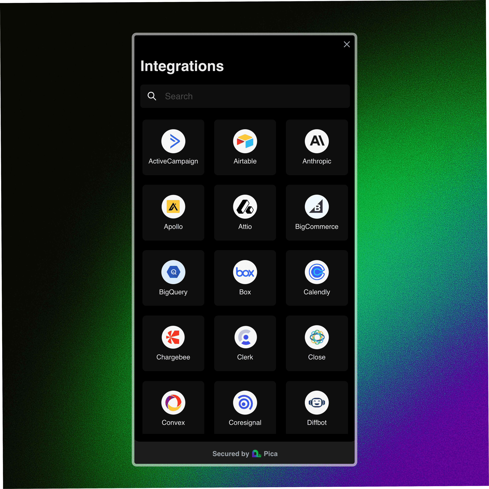

<Tip>
Key Benefit: Empowers developers to offer seamless and secure tool integrations to their customers through a customizable UI that abstracts away all of the complexity associated with building secure authentication flows, ensuring a smooth onboarding experience while prioritizing security.
</Tip>

# Overview

Implementing authentication flows that handle every possible error state and edge case across multiple integrations can be a daunting task. AuthKit makes this easy by providing a hosted, pre-built, customizable authentication UI with automatic handling of:

- Secure authentication via OAuth and API Keys
- Automatic handling of authentication and refresh tokens
- Self-hosted OAuth apps (using your Client ID and Client Secret)
- Customizable branding and white labeling

# QuickStart

## Server

```typescript
import { NextRequest, NextResponse } from "next/server";
import { AuthKitToken } from "@picahq/authkit-node";

export async function POST(req: NextRequest) {
  const authKitToken = new AuthKitToken(process.env.PICA_SANDBOX_API_KEY as string);
  
  const token = await authKitToken.create({
    identity: "user_123", // a meaningful identifier (i.e., userId, teamId or organizationId)
    identityType: "user" // can be either user, team or organization
  });

  return NextResponse.json(token);
}
```

## Client

```typescript
import { useAuthKit } from "@picahq/authkit";
import { Button } from "@/components/ui/button";

export function AuthKitButton() {
  const { open } = useAuthKit({
    token: {
      url: "https://api.your-company-name.com/authkit-token",
      headers: {},
    },
    onSuccess: (connection) => {},
    onError: (error) => {},
    onClose: () => {},
  });

  return (
    <Button onClick={open}>
      Connect Tools
    </Button>
  );
}
```

<Info>
At Pica, we dogfood our own products. AuthKit powers the connection experience in Pica's dashboard. Create a free account, navigate to the OneTool tab, click the "Create Connection" button, and voilà - you'll see AuthKit in action!
</Info>