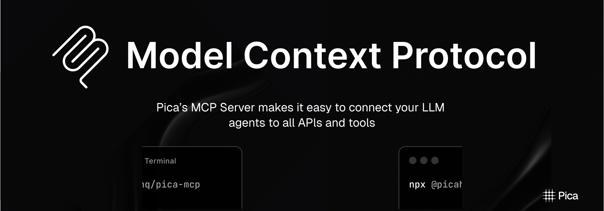

[](https://smithery.ai/server/@picahq/pica)



<Card title="mcp-server" icon="server" href="https://smithery.ai/server/@picahq/pica" horizontal>
Install the MCP Server to connect your LLM applications to external data sources
</Card>

# What is MCP?

[Model Context Protocol (MCP)](https://modelcontextprotocol.io) is a system that lets AI apps, like [Claude Desktop](https://claude.ai/download), connect to external tools and data sources. It gives a clear and safe way for AI assistants to work with local services and APIs while keeping the user in control.

<Info>Want to learn more about Anthropic's Model Control Protocol? [Visit the website](https://www.claudemcp.com) or [read the docs](https://modelcontextprotocol.io/introduction).</Info>

This MCP server allows Claude Desktop and anything using the [Model Context Protocol](https://modelcontextprotocol.io) to securely interact with all these connections through natural language requests.

With Pica MCP Server, you can:

- **Access Multiple Data Sources**: Query databases, fetch files, and retrieve information across services
- **Automate Workflows**: Trigger actions and automate tasks across your connected platforms
- **Enhance LLM Capabilities**: Give Claude Desktop powerful real-world capabilities through API access

Pica supports [70+ connections](https://app.picaos.com/tools) (with more added regularly) across categories like:

# Setup

Follow the guide below or watch this video for a quickstart:

<iframe
  width="100%"
  height="350"
  src="https://www.youtube.com/embed/JJ62NUEkKAs"
  title="MCP Server Setup Guide"
  frameborder="0"
  allow="accelerometer; autoplay; clipboard-write; encrypted-media; gyroscope; picture-in-picture"
  allowfullscreen
></iframe>

### Using npx

You can use this package directly with npx:

```bash
npx @picahq/pica-mcp
```

Or install it globally:

```bash
npm install -g @picahq/pica-mcp
```

### Installing via Smithery

To install pica for Claude Desktop automatically via [Smithery](https://smithery.ai/server/@picahq/pica):

```bash
npx -y @smithery/cli install @picahq/pica --client claude
```

### Environment Setup

This server requires a [Pica API key](https://app.picaos.com/settings/api-keys). Set the environment variable:

```bash
export PICA_SECRET=your_pica_secret_key
```

### Using Docker

Build the Docker Image:

```bash
docker build -t pica-mcp-server .
```

Run the Docker Container:

```bash
docker run -e PICA_SECRET=your_pica_secret_key pica-mcp-server
```

### Manual Installation

Install dependencies:

```bash
npm install
```

Build the server:

```bash
npm run build
```

For development with auto-rebuild:
```bash
npm run watch
```

### Using Claude Desktop

To use with [Claude Desktop](https://claude.ai/download), add the server config:

On MacOS: `~/Library/Application\ Support/Claude/claude_desktop_config.json`

On Windows: `%APPDATA%/Claude/claude_desktop_config.json`

#### Docker

To use the Docker container with Claude Desktop, update your `claude_desktop_config.json` with:

```json
{
  "mcpServers": {
    "pica-mcp-server": {
      "command": "docker",
      "args": [
        "run",
        "--rm",
        "-i",
        "-e", "PICA_SECRET=YOUR_PICA_SECRET_KEY",
        "pica-mcp-server"
      ]
    }
  }
}
```

#### Manual

```json
{
  "mcpServers": {
    "pica-mcp-server": {
      "command": "node",
      "args": [
        "/path/to/pica-mcp-server/build/index.js"
      ],
      "env": {
        "PICA_SECRET": "YOUR_PICA_SECRET_KEY"
      }
    }
  }
}
```

## Debugging

Since MCP servers communicate over stdio, debugging can be challenging. We recommend using the [MCP Inspector](https://github.com/modelcontextprotocol/inspector), which is available as a package script:

```bash
npm run inspector
```

The Inspector will provide a URL to access debugging tools in your browser.


## Usage

Once you've added the server config and connected some platforms in the [Pica dashboard](https://app.picaos.com/connections), restart Claude Desktop and try out some examples:

- What connections do I have access to?
- Send an email using gmail to hello@picaos.com
- What actions can I perform with google sheets?
- Create an event in my calendar
- List 5 users from my postgres users table
- Send a message in slack to the #general channel with today's weather

## Demo

<iframe
  width="100%"
  height="350"
  src="https://www.youtube.com/embed/0jeasO20PyM"
  title="MCP Server Demo"
  frameborder="0"
></iframe>
