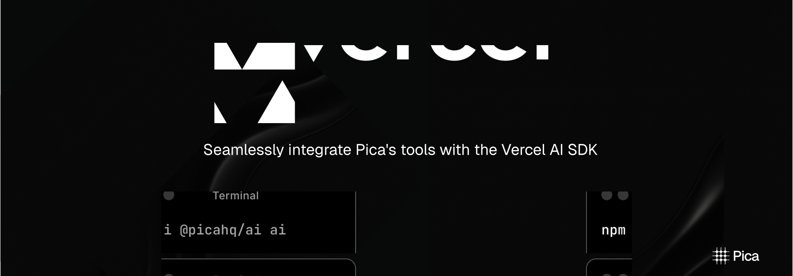

[](https://npmjs.com/package/@picahq/ai)



<Card title="@picahq/ai" icon="npm" href="https://npmjs.com/package/@picahq/ai" horizontal>
Install the Pica AI package to unlock powerful tools for the Vercel AI SDK
</Card>

The Pica AI SDK is a powerful tool that allows you connect Pica with Vercel's AI SDK for enhanced AI capabilities.

## Configuration

The Pica SDK can be configured with the following options:

| Option | Type | Required | Default | Description |
| --- | --- | --- | --- | --- |
| serverUrl | `String` | No | https://api.picaos.com | URL for self-hosted Pica server. |
| connectors | `String[]` | No | List of connector keys to filter by. Pass ["*"] to initialize all available connectors, or specific connector keys to filter. If empty, no connections will be initialized |
| actions | String[] | No | All actions | List of action ids to filter by |
| permissions | `"read"` \| `"write"` \| `"admin"` | No | `"admin"` | Permissions for the Pica client. `"read"` will only allow GET requests, `"write"` will allow POST/PUT/PATCH requests, and `"admin"` will allow all methods. |
| identity | `String` | No | None | Filter connections by specific identifier. |
| identityType | `"user", "team", "project", "organization"` | No | None | Filter connections by identity type. |
| authkit | Boolean | No | false | If true, the SDK will use Authkit to connect to prompt the user to connect to a platform that they do not currently have access to |
| knowledgeAgent | Boolean | No | false | If true, the SDK will never execute actions, but will use Pica's knowledge to generate code. If true, use pica.intelligenceTool instead of pica.oneTool |
| knowledgeAgentConfig | Object | No | `{ includeEnvironmentVariables: true }` | Configuration for the Knowledge Agent. If `includeEnvironmentVariables` is true, the SDK will return a reminder to include environment variables in the output |

```typescript
const pica = new Pica(process.env.PICA_SECRET_KEY!, {
  serverUrl: "https://my-hosted-instance.com",
  connectors: [
    "test::gmail::default::0fc9f64d309349be8cccb63a02e16c2a",
    "test::notion::default::0fc9f64d309349be8cccb63a02e16c2a",
    "test::postgres::default::0fc9f64d309349be8cccb63a02e16c2a",
  ]
});
```

## Installation

Install the [Pica AI package](https://npmjs.com/package/@picahq/ai):

```bash
npm install @picahq/ai
```

## Examples

<Tabs>
  <Tab title="Next.js API Route">
Install the required packages:

```bash
npm install ai openai @picahq/ai
```

Here's an example of using Pica with OpenAI in a Next.js API route:

```typescript
import { openai } from "@ai-sdk/openai";
import { convertToCoreMessages, streamText } from "ai";
import { Pica } from "@picahq/ai";

export async function POST(request: Request) {
  const { messages } = await request.json();

  const pica = new Pica(process.env.PICA_SECRET_KEY as string);

  const systemPrompt = await pica.generateSystemPrompt();

  const stream = streamText({
    model: openai("gpt-4o"),
    system: systemPrompt,
    tools: { ...pica.oneTool },
    messages: convertToCoreMessages(messages),
    maxSteps: 5,
  });

  return (await stream).toDataStreamResponse();
}
```
  </Tab>
  <Tab title="Express Server">
1. **Install dependencies**

```bash
npm install express @ai-sdk/openai ai @picahq/ai dotenv
```

2. **Create the server**

```typescript
import express from "express";
import { openai } from "@ai-sdk/openai";
import { generateText } from "ai";
import { Pica } from "@picahq/ai";
import * as dotenv from "dotenv";

dotenv.config();

const app = express();
const port = process.env.PORT || 3000;

app.use(express.json());

app.post("/api/ai", async (req, res) => {
  try {
    const { message } = req.body;

    // Initialize Pica
    const pica = new Pica(process.env.PICA_SECRET_KEY);

    // Generate the system prompt
    const systemPrompt = await pica.generateSystemPrompt();

    // Create the stream
    const { text } = await generateText({
      model: openai("gpt-4o"),
      system: systemPrompt,
      tools: { ...pica.oneTool },
      prompt: message,
      maxSteps: 5,
    });

    res.setHeader("Content-Type", "application/json");
    
    res.status(200).json({ text });
  } catch (error) {
    console.error("Error processing AI request:", error);

    res.status(500).json({ error: "Internal server error" });
  }
});

app.listen(port, () => {
  console.log(`Server is running on port ${port}`);
});

export default app;
```

3. **Test the server**

```bash
curl --location 'http://localhost:3000/api/ai' \
--header 'Content-Type: application/json' \
--data '{
    "message": "What connections do I have access to?"
}'
```
  </Tab>
</Tabs>

### AuthKit

The authkit configuration option initiates Pica's AuthKit. When enabled, the SDK will prompt the user to connect to a platform that they do not currently have access to.

<Tabs>
  <Tab title="Backend">
```typescript
const pica = new Pica(process.env.PICA_SECRET_KEY!, { 
  authkit: true // Simply pass true to enable AuthKit
});
```
  </Tab>
  <Tab title="Frontend">
  </Tab>
  <Tab title="Hooks">
  </Tab>
</Tabs>

### Knowledge Agent

The knowledge agent is a configuration optional that initiates Pica's knowledge agent. When enabled, the knowledge agent will be used to generate code instead of executing actions.

```typescript
const pica = new Pica(process.env.PICA_SECRET_KEY!, { 
  knowledgeAgent: true
});
```

## Demo

You can now use the chat interface directly in the [Pica Dashboard](https://app.picaos.com/chat).

<iframe
  width="100%"
  height="400"
  src="https://www.youtube.com/embed/0dVQw_gkMlc"
  title="Pica OneTool Demo with Vercel AI SDK"
  frameborder="0"
  allow="accelerometer; autoplay; clipboard-write; encrypted-media; gyroscope; picture-in-picture"
  controls
  allowFullScreen
></iframe>

<Card title="@picahq/onetool-demo" icon="github" href="https://github.com/picahq/onetool-demo" horizontal>
View on GitHub
</Card>

<Info>Want to learn more about Vercel AI SDK? [Read the docs](https://sdk.vercel.ai/docs/introduction).</Info>