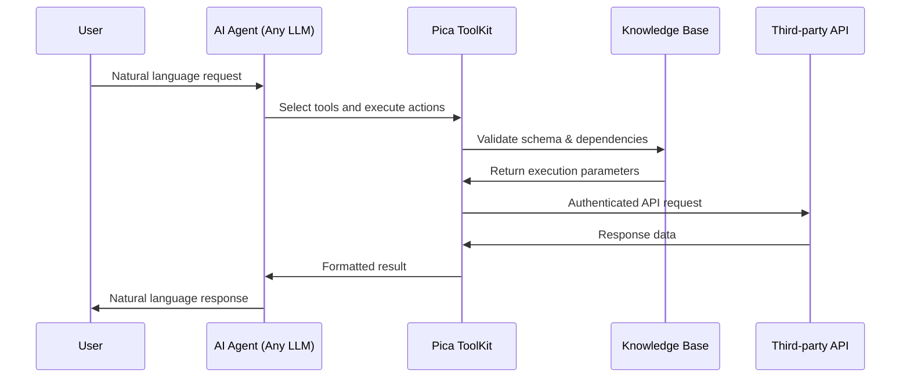

<Frame caption="ToolKit provides your AI agents with intelligent, authenticated access to 200+ integrations">
  
  
</Frame>

ToolKit is the complete infrastructure and data layer for building AI agents that interact with third-party integrations. It provides a single set of tools that work across all major AI frameworks—Vercel AI SDK, LangChain, OpenAI Agents, Mastra, and MCP—giving your agents the intelligence to execute actions flawlessly.

<Note>
ToolKit powers production AI agents processing thousands of integration actions daily. [Create a free account](https://app.picaos.com) to give your agent access to 200+ integrations in minutes.
</Note>

## Why use ToolKit?

Building AI agents that reliably interact with third-party APIs is complex. ToolKit solves this by providing:

<CardGroup cols={2}>
  <Card icon="brain" title="Intelligence built-in">
    Pica's knowledge base handles schemas, edge cases, dependencies, and best practices for every action across 200+ integrations
  </Card>
  <Card icon="shield-check" title="Enterprise security">
    Automatic authentication, token management, and compliance built-in—no credential storage in your codebase
  </Card>
  <Card icon="layer-group" title="Framework agnostic">
    Works with any AI framework or LLM—Vercel AI SDK, LangChain, OpenAI, Claude, Mastra, MCP, and more
  </Card>
  <Card icon="sliders" title="Fine-grained control">
    Scope access by connection, action, and permission level to control exactly what your agent can do
  </Card>
</CardGroup>

## How it works

ToolKit sits between your AI agent and third-party integrations, providing intelligent tool execution with any LLM:

### The execution flow explained

<Steps>
  <Step title="User makes a request">    
    Your user asks the AI agent to perform an action in natural language (e.g., "Send a summary email to the team" or "Create a lead in Salesforce").
  </Step>
  
  <Step title="Agent selects tools">
    Your AI agent (powered by any LLM—GPT-4, Claude, Gemini, etc.) selects the appropriate ToolKit tools based on the request.
  </Step>
  
  <Step title="ToolKit validates with knowledge">
    ToolKit consults Pica's knowledge base to validate request schemas, handle dependencies, and apply best practices for that specific integration.
  </Step>
  
  <Step title="Authenticated execution">
    ToolKit makes the authenticated API request using securely stored credentials, handling rate limits, retries, and edge cases automatically.
  </Step>
  
  <Step title="Result returned to agent">
    The formatted response is returned to your agent, which synthesizes it into a natural language response for the user.
  </Step>
</Steps>

<Info>
ToolKit works with **any LLM** and **any framework**. Whether you're using OpenAI, Anthropic, Google, or open-source models, ToolKit provides the same intelligent tool execution layer.
</Info>

## What makes ToolKit powerful?

### Pica's Knowledge Base

The secret to ToolKit's reliability is Pica's comprehensive knowledge base—a constantly evolving intelligence layer that ensures flawless action execution.

**What the knowledge base covers:**

<AccordionGroup>
  <Accordion title="Schema definitions for every action" icon="file-code">
    Complete request and response schemas for 25,000+ actions across 200+ integrations. Your agent always sends properly structured data.
  </Accordion>
  
  <Accordion title="Edge case handling" icon="triangle-exclamation">
    Rate limits, pagination, nested objects, required field combinations, API quirks, and error recovery patterns—all handled automatically.
  </Accordion>
  
  <Accordion title="Dependencies and prerequisites" icon="link">
    Understands when actions require specific data from other endpoints, what fields depend on each other, and the proper sequence of operations.
  </Accordion>
  
  <Accordion title="Custom composite actions" icon="wand-magic-sparkles">
    Pre-built workflows that combine multiple actions intelligently (e.g., "create contact, add to list, send email" as a single operation).
  </Accordion>
  
  <Accordion title="Best practices and optimization" icon="rocket">
    Field formatting preferences, optimal parameter combinations, and integration-specific conventions for reliable results.
  </Accordion>
  
  <Accordion title="Continuous updates" icon="arrows-rotate">
    The knowledge base evolves with API changes, new endpoints, and real-world usage patterns—keeping your agent ahead of the curve.
  </Accordion>
</AccordionGroup>

This knowledge base is what transforms ToolKit from a simple API wrapper into an intelligent execution layer. Your agent doesn't need to learn API documentation—Pica's knowledge ensures every action works perfectly from day one.

## Fine-grained access control

ToolKit gives you precise control over what your agent can do:
<CardGroup cols={3}>
  <Card title="Connection Scope" icon="user">
    Limit access to specific connections. Each agent can only act on the connections you specify.
  </Card>
  <Card title="Action Scope" icon="bolt">
    Restrict which operations or API actions the agent is allowed to perform.
  </Card>
  <Card title="Permission Scope" icon="lock">
    Control the types of operations (read, write, admin) the agent can execute.
  </Card>
</CardGroup>

This enables you to build secure, multi-tenant agents where each user's agent only accesses their own connected accounts and performs authorized actions.

## Try in Playground

<Frame caption="Test ToolKit with your connected integrations in the Playground">
  
</Frame>

Want to see ToolKit in action before integrating it into your agent? The [Playground](https://app.picaos.com/connections) in your Pica dashboard is powered by ToolKit and lets you test chatting with any integrations you've connected.

Simply connect an integration, head to **Try in Playground**, and start asking questions or making requests in natural language. The Playground uses the same ToolKit infrastructure that powers your production agents, giving you a live preview of how your agent will interact with each integration.

<Info>
The Playground is perfect for testing action combinations, validating authentication, and exploring what's possible with each integration before writing any code.
</Info>

## Use cases

ToolKit powers AI agents across every industry and workflow:

<AccordionGroup>
  <Accordion title="Communication & Productivity" icon="comments">
    - Compose and send Gmail emails containing meeting summaries to team members
    - Schedule Google Calendar events with specified date/time parameters
    - Post messages with campaign analytics to designated Slack channels
    - Search and retrieve Q3 planning materials from Google Drive
    - Manage Notion workspaces with project tracking databases
  </Accordion>
  
  <Accordion title="Data Access & Analysis" icon="chart-line">
    - Execute PostgreSQL queries to identify top customer segments
    - Generate new Google Sheets workbooks populated with sales metrics
    - Retrieve closing opportunity data from Salesforce CRM
    - Analyze customer behavior patterns across multiple data sources
    - Create automated reports combining data from various integrations
  </Accordion>
  
  <Accordion title="Business Operations" icon="briefcase">
    - Create customer support cases in Zendesk from feedback data
    - Process customer refund transactions via Stripe
    - Convert website inquiries into HubSpot lead entries
    - Generate client invoices through QuickBooks integration
    - Automate order fulfillment workflows across systems
  </Accordion>
  
  <Accordion title="AI & Content Generation" icon="sparkles">
    - Create DALL-E images matching product requirements
    - Convert meeting audio to text using ElevenLabs
    - Conduct market research via Tavily/SerpApi integrations
    - Perform sentiment analysis on support interactions
    - Generate and distribute content across multiple platforms
  </Accordion>
</AccordionGroup>

<Info>
Want to see what you can build with ToolKit? Check out real-world examples in our <a href="/showcase">Showcase</a>.
</Info>

## Framework integrations

Choose your framework and get started in minutes:

<CardGroup cols={3}>
  <Card
    title="Vercel AI SDK"
    href="/toolkit/vercel-ai-sdk"
    img="/images/toolkit/vercel.jpg"
    arrow="true"
  >
    Build AI agents with the Vercel AI SDK and ToolKit
  </Card>
  <Card
    title="LangChain"
    img="/images/toolkit/langchain.jpg"
    arrow="true"
    href="/toolkit/langchain"
  >
    Integrate ToolKit tools into your LangChain agents
  </Card>
  <Card
    title="OpenAI Agents"
    img="/images/toolkit/openai.jpg"
    arrow="true"
    href="/toolkit/openai-agents"
  >
    Use ToolKit with OpenAI's Assistants API
  </Card>
  <Card
    title="Mastra"
    img="/images/toolkit/mastra.png"
    arrow="true"
    href="/toolkit/mastra"
  >
    Add ToolKit to your Mastra workflows
  </Card>
  <Card
    title="MCP Server"
    img="/images/toolkit/mcp.jpg"
    arrow="true"
    href="/mcp"
  >
    Access ToolKit via Model Context Protocol
  </Card>
  <Card
    title="More coming soon"
    icon="rocket"
    href="mailto:hello@picaos.com"
    cta="Let us know!"
  >
    Got a framework you want to see supported?
  </Card>
</CardGroup>

## What's next?

<CardGroup cols={2}>
  <Card
    title="Get started with your framework"
    icon="rocket"
    href="/toolkit/vercel-ai-sdk"
  >
    Choose your AI framework and integrate ToolKit in minutes
  </Card>
  <Card
    title="Browse available actions"
    icon="list"
    href="/api-reference/core/available-actions"
  >
    Explore the 25,000+ actions across 200+ integrations
  </Card>
  <Card
    title="View example agents"
    icon="book"
    href="/use-cases/overview"
  >
    See real-world examples of agents built with ToolKit
  </Card>
  <Card
    title="Create free account"
    icon="user-plus"
    href="https://app.picaos.com"
  >
    Sign up and start building in under 5 minutes
  </Card>
</CardGroup>

