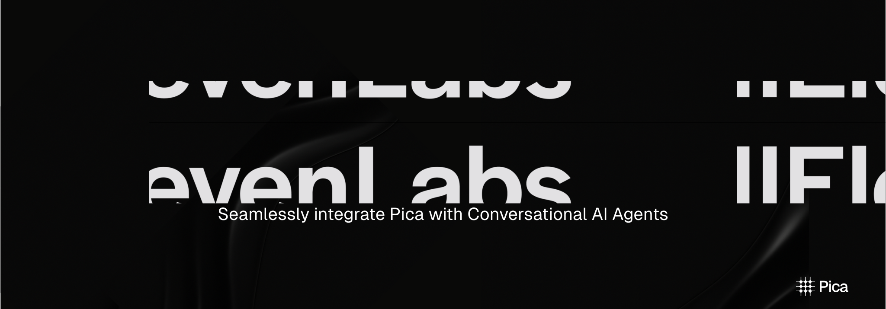

<Card title="ElevenLabs Conversational AI Agent Example" icon="github" href="https://github.com/picahq/awesome-pica/tree/main/elevenlabs-conversational-ai-agent" horizontal>
Clone the repository to get started with the ElevenLabs Conversational AI Agent.
</Card>

## Getting Started

This example demonstrates how to integrate an [ElevenLabs Conversational AI Agent](https://elevenlabs.io/conversational-ai) with [Pica OneTool](https://docs.picaos.com/core/one-tool).

### **Clone the repository:**

```bash
git clone https://github.com/picahq/awesome-pica.git
cd awesome-pica/elevenlabs-conversational-ai-agent
```

## **Prerequisites**
Before you begin, ensure you have:
- A [**Pica**](https://picaos.com) account
- An [**ElevenLabs**](https://elevenlabs.io/signup) account
- **Node.js** installed
- **ngrok** installed ([Installation guide](https://ngrok.com/download))

## **Setup**

### **1. Create a Pica Connection**
1. Go to your [Pica dashboard](https://app.picaos.com/connections).
2. Click **"Connections"** and create a new connection.

### **2. Retrieve Your Pica Secret Key**
1. In the Pica dashboard, go to the **"Connections"** tab.
2. Click **"Settings"** and copy the [secret key](https://app.picaos.com/settings/api-keys).

### **3. Get Your ElevenLabs API Key**
1. Log in to [ElevenLabs](https://elevenlabs.io/signup).
2. Navigate to your [API keys](https://elevenlabs.io/app/settings/api-keys) and copy your key.

### **4. Install Dependencies**
Run the following command:
```bash
npm install
```  

### **5. Start the Server**
Run the server locally:
```bash
npm start
```  
To expose your server to the internet, use `ngrok`:
```bash
ngrok http 3000
```  
Copy the public URL generated by `ngrok`.

## **Configuration**

Create a `.env` file and add the following:


| Variable | Description                                                            | Required |
|----------|------------------------------------------------------------------------|----------|
| `PICA_SECRET_KEY` | Your [Pica API secret key](https://app.picaos.com/settings/api-keys)   | Yes |
| `OPENAI_API_KEY` | Your OpenAI API key                                                    | Yes |
| `PICA_URL` | Your Pica endpoint URL [copied from ngrok]                             | Yes |
| `ELEVEN_LABS_API_KEY` | Your [ElevenLabs API key](https://elevenlabs.io/app/settings/api-keys) | Yes |

## **Create Your ElevenLabs Agent**

Run the initialization script:
```bash
./init.sh
```  
Once successful, you'll see:
```
Agent created successfully. You can access it at:  
https://elevenlabs.io/app/talk-to?agent_id=<agent_id>
```  
Copy the provided URL and open it in your browser.

## Usage

Here are some example commands you can use to get started:

- What connections are available?
- Send an email using gmail to john@doe.com
- Create a new Shopify product
- Insert a new record into my Postgres database
- Create a record in Airtable
- What actions are supported for Attio?
- Search the web for the best restaurants in SF using Exa


## Support for the [ElevenLabs Hackathon](https://hackathon.elevenlabs.io/)?

For support, please join the [ElevenLabs Discord server](https://discord.com/invite/elevenlabs)!